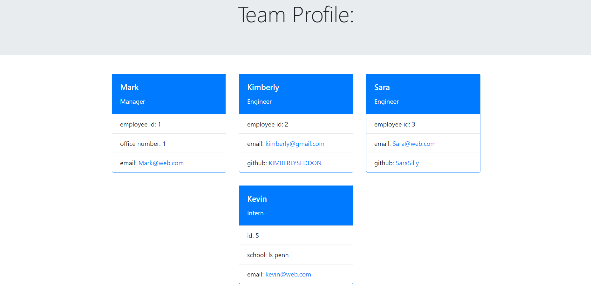

# team-profile-generator

## Description

This application was created so that a manager could easily keep track of their team members' information such as name, id, email, github, school, ect.
This app is built in Node js and uses bootstrap and html.

## Installation

In order to use this application you must open the integrated terminal within the folder. Then type in *node index.js* to begin the prompts. 

Answer each prompt and when done your new HTML file will be waiting in the dist folder. 

## Usage

Answer each question prompted as thoroughly as possible to ensure a high quality product. Click the link below for a walk through of the process:

https://drive.google.com/file/d/1NVOOplTpxUhq9USsNNCFpA8u2JaNQ653/view

Team profile cards made in walk-through video:

## Credits 

I was able to build this app from knowledge learned in the course and assistance from learning assistance and tutor.
